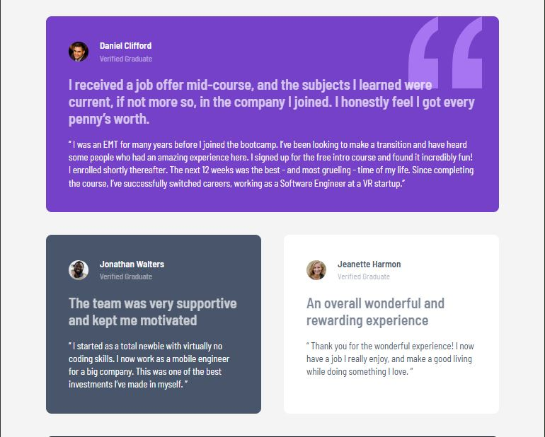
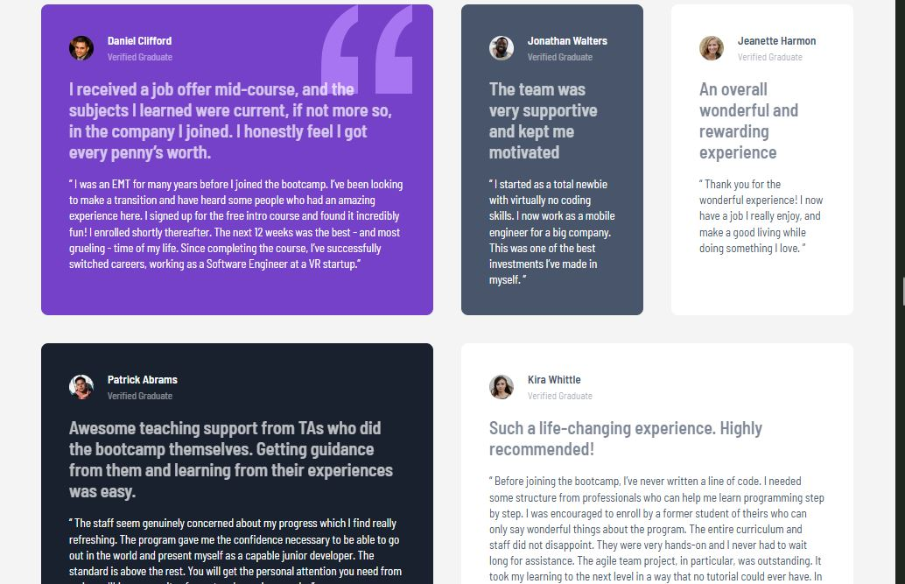

# Frontend Mentor - Testimonials grid section solution

This my solution to the Testimonials grid section challenge on Frontend Mentor. The goal of this challenge was to build a responsive
Testimonials grid layout solution

## Table of contents

- [Overview](#overview)
  - [The challenge](#the-challenge)
  - [Screenshot](#screenshot)
  - [Links](#links)
- [My process](#my-process)
  - [Built with](#built-with)
  - [What I learned](#what-i-learned)
  - [Continued development](#continued-development)
  - [Useful resources](#useful-resources)
  - [AI Collaboration](#ai-collaboration)
- [Author](#author)

## Overview

### The challenge

Users should be able to:

- View the optimal layout for the site depending on their device's screen size

### Screenshot

### Links

- Solution URL: [Add solution URL here](https://your-solution-url.com)
- Live Site URL: [Add live site URL here](https://your-live-site-url.com)

## My process

### Built with

- Semantic HTML5 markup
- CSS custom properties
- Flexbox
- CSS Grid
- Mobile-first workflow
- Responsive design

### What I learned

During this project, I improved my understanding of CSS Grid and responsive layout structures across mobile, tablet, and desktop screens. I also learned how to combine Grid and Flexbox effectively by using Grid for page layout and Flexbox for aligning content inside components.

One of the biggest lessons was understanding how grid-column and grid-row spanning work to create more advanced layouts.

### Continued development

In future projects, I want to continue improving my responsive design skills and become more confident with advanced CSS Grid layouts, accessibility, and scalable CSS architecture.

### Useful resources

- [Layout](https://layout.bradwoods.io/) - Helped me better understand responsive layouts, spacing, and CSS Grid structure.
- [MDN Web Docs](https://developer.mozilla.org/) - Helped me better understand CSS Grid, Flexbox, and responsive design concepts.

### AI Collaboration

During this project, I used ChatGPT and GitHub Copilot to guide my development process. AI tools helped me:

- debug layout issues,
- understand CSS Grid behavior,
- structure scalable CSS,
- improve semantic HTML,
- and refine responsive layouts.

The most useful part was learning the reasoning behind Grid placement and responsive design decisions instead of only copying solutions.

## Author

- GitHub - [AK-Fwana](https://github.com/AK-Fwana)
- Frontend Mentor - [@AK-Fwana](https://www.frontendmentor.io/profile/AK-Fwana)
